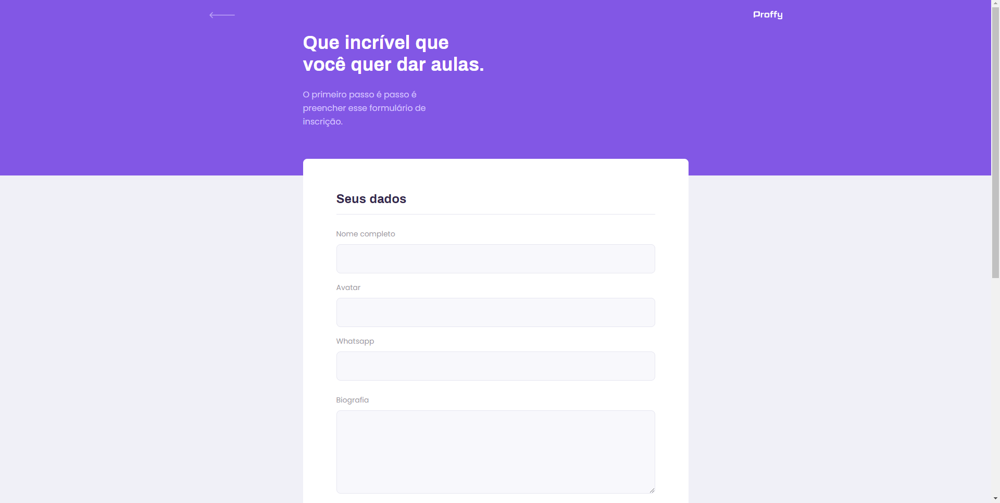
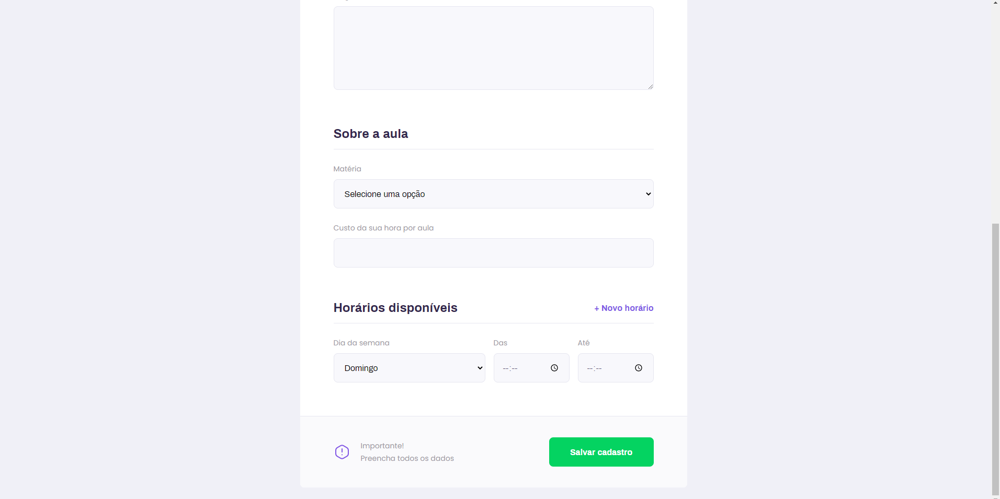
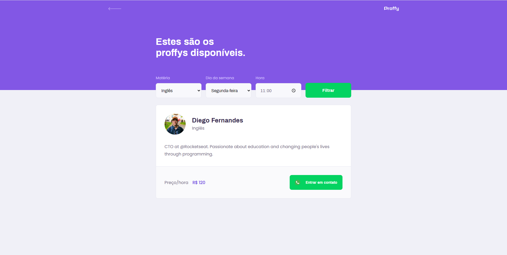
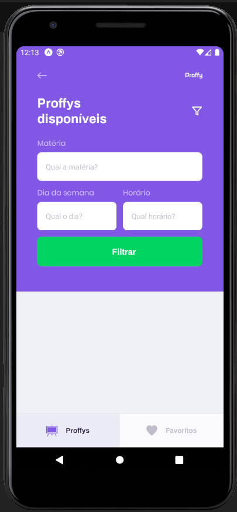

<h1 align="center">Proffy</h1>

Proffy é uma plataforma online que tem o objetivo de conectar alunos com professores e encontrar os melhores horário para ambos aprenderem.<br/>
Essa plataforma foi desenvolvida durante a **NLW - Next Level Week 2** da [Rocketseat](https://rocketseat.com.br/).

<h3 align="center"> 
 
<h3/>

<h4 align="center"> 
	🚧 Em construção...  🚧
</h4>

<ul style="list-style-type:none;">
 <li>
  <a href="#funcionalidades">Funcionalidades</a>
 </li>
 <li>
  <a href="#layout">Layout</a>
 </li>
 <li>
  <a href="#como-usar">Como usar</a>
 </li> 
 <li>
  <a href="#tecnologias">Tecnologias</a>
 </li>  
 <li>
   <a href="#autor">Autor</a>
 </li> 
</ul>

### Funcionalidades

- [x] Cadastro de usuário
- [x] Cadastro de cliente
- [ ] Cadastro de produtos

## Layout
### Web (Typescript + ReactJS)
<p align="center" style="display: flex; align-items: flex-start; justify-content: center;">
  
  
  
</p>
<a href="https://www.loom.com/share/927fb64ff2574b5bbfe65179ac3a76ae">Link do vídeo da parte web </a>

### Mobile (Typecript + React Native)
<p align="center" style="display: flex; align-items: flex-start; justify-content: center;">
    
  
  
  
</p>
<a href="https://www.loom.com/share/50943d1bb05b4fbea5faaefc8f97264b">Link do vídeo da parte mobile </a>

## Como usar
### Pré Requisitos
Antes de começar, você vai precisar ter instalado em sua máquina as seguintes ferramentas:
[Git](https://git-scm.com), [Node.js](https://nodejs.org/en/). 
Além disto é bom ter um editor para trabalhar com o código como [VSCode](https://code.visualstudio.com/) <br/>
Após ter feito a configuração de instalação na máquina é necessário fazer o download do repostiório [aqui](https://github.com/joseaugustodardengo/Proffy/archive/master.zip)
ou realizar o clone do repositório.
```
git clone https://github.com/joseaugustodardengo/Proffy
```
Após feito o download, só seguir os passos a seguir no terminal do seu sistema operacional, para conseguir executar os serviços da aplicação.


### 🎲 Back-End (servidor)

```bash
# Acesse a pasta do projeto no terminal/cmd
$ cd Proffy

# Vá para a pasta server
$ cd server

# Instale as dependências
$ npm install

# Execute a aplicação
$ npm run start

# Criar o Banco de dados
$ npm knex:migrate

# O servidor inciará na porta:3333 - acesse <http://localhost:3333>
```

### 🧭 Aplicação web (Frontend)
OBS: para realizar os seguintes comandos, o servidor tem que estar em execução

```bash
# Vá para a pasta da aplicação Front End
$ cd web

# Instale as dependências
$ npm install

# Execute a aplicação em modo de desenvolvimento
$ npm run start

# A aplicação será aberta na porta:3000 - acesse http://localhost:3000
```

### 🧭 Aplicação mobile (Mobile)
Caso deseja executar o mobile, é necessário ter instalado o [expo](https://expo.io/) em um sua máquina.
OBS 1: para realizar os seguintes comandos, o servidor tem que estar em execução

```bash
# Vá para a pasta da aplicação Mobile
$ cd mobile

# Instale as dependências
$ npm install

# Alterando a configuração do arquivo api.ts, dentro do caminho: <src/services>. Será necessário colocar na linha a seguir o IP do seu computador
$ baseURL: 'http://ip-do-computador:3333'

# Execute a aplicação em modo de desenvolvimento
$ npm run start
```

### Tecnologias

As seguintes ferramentas foram usadas na construção do projeto:

- [Expo](https://expo.io/)
- [Node.js](https://nodejs.org/en/)
- [React](https://pt-br.reactjs.org/)
- [React Native](https://reactnative.dev/)
- [TypeScript](https://www.typescriptlang.org/)

### Autor


Feito por **José Augusto Franco Dardengo** <br/>
👋🏽 Entre em contato!

[](https://www.linkedin.com/in/jose-augusto-franco-dardengo/) 
[](mailto:jfrancodardengo@gmail.com)
